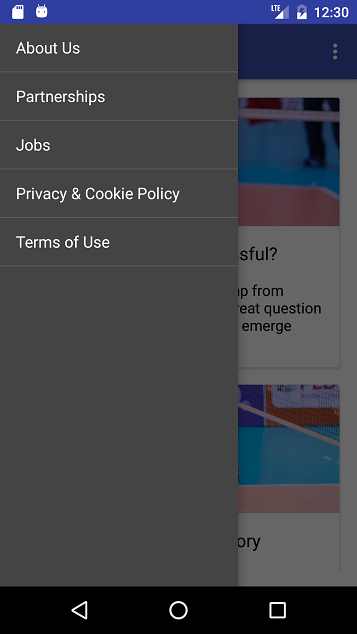
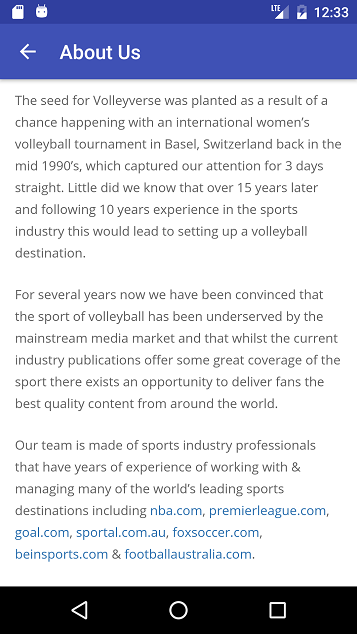

# Volleyverse

This is an Android application for the Volleyverse website.

## How to Run

Development and testing has taken place in Android Studio. The application can be easily deployed on an
emulator or a physical device through Android Studio. Thus far, the application has only been tested on
an Android emulator (AVD) running Android 6.0 with API 23.

## Current State

The application is currently able to load and refresh posts.

### Screenshots

App icon

Splash screen

Main posts view

Article view

Navigation drawer

"Static page" (e.g. About Us)

## Next Steps

- Add a feedback activity
- Implement offline loading using WebView caching mechanisms
- Get rid of the gray bar in WebView for posts
- Add push functionality and a settings activity to allow the user to control push subscriptions
- Tweak color schemes/look and feel
- Test on different platforms/versions
